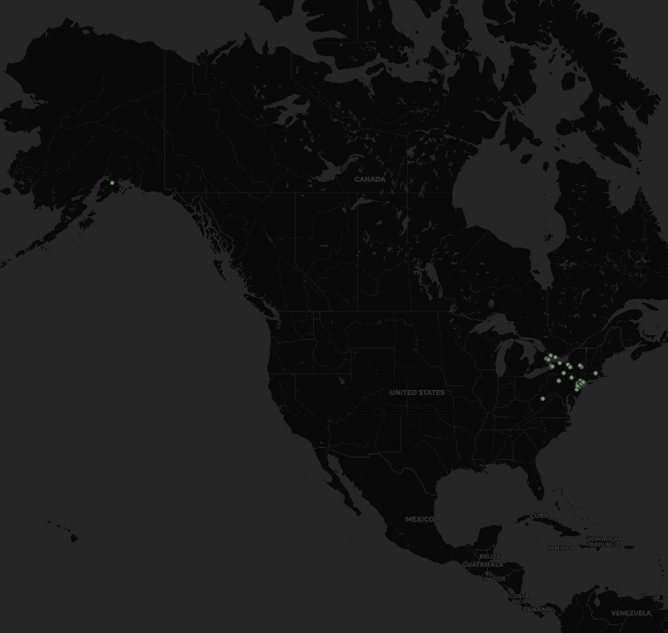

# **Cedrik Pearson**
### Professor Bo Zhao
### Geographhy 458
### Lab 2

The map I made for Lab 2 scrubbed tweets posted in the New York state area and Alaska at about 7PM PST, or 10PM EST, over a 60 second period. The data was then visualized on a map using QGIS to display the spatial variation:

It's quickly apparent that even though the scrub was done late on a Sunday night (on the East Coast), There's way more tweets in New York than Alaska. I originally wanted to compare the variation of tweets about coronavirus from a high impact area vs. a low impact area, but kept running into trouble when trying to run the script. Instead, I just looked at the geographic variation between the two states. Even though it was a more favorable time for tweeting in Alaska, the lower population made for significantly less tweets over the 1 minute period. 
